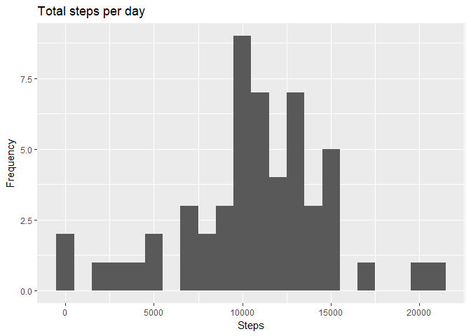
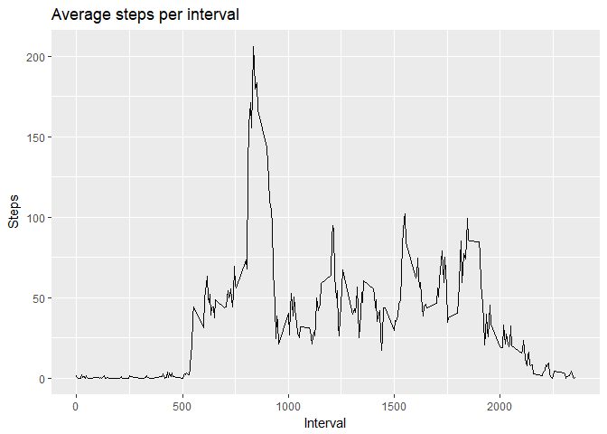
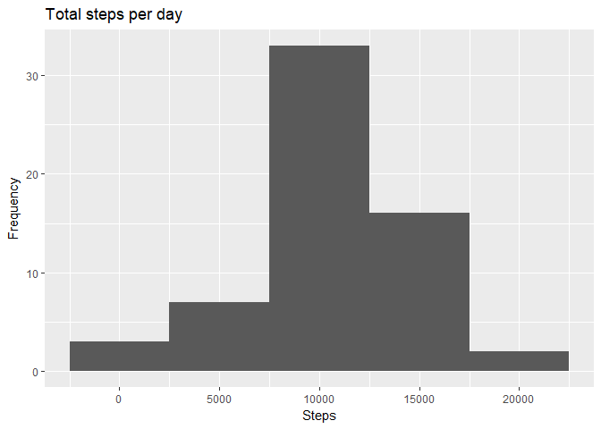

#Introduction 
It is now possible to collect a large amount of data about personal movement using activity monitoring devices such as a Fitbit, Nike Fuelband, or Jawbone Up. These type of devices are part of the "quantified self" movement - a group of enthusiasts who take measurements about themselves regularly to improve their health, to find patterns in their behavior, or because they are tech geeks. But these data remain under-utilized both because the raw data are hard to obtain and there is a lack of statistical methods and software for processing and interpreting the data.

This assignment makes use of data from a personal activity monitoring device. This device collects data at 5 minute intervals through out the day. The data consists of two months of data from an anonymous individual collected during the months of October and November, 2012 and include the number of steps taken in 5 minute intervals each day.

#Data  
The data for this assignment can be downloaded from the course web site:

Dataset: Activity monitoring data [52K]
The variables included in this dataset are:

steps: Number of steps taking in a 5-minute interval (missing values are coded as NA)
date: The date on which the measurement was taken in YYYY-MM-DD format
interval: Identifier for the 5-minute interval in which measurement was taken
The dataset is stored in a comma-separated-value (CSV) file and there are a total of 17,568 observations in this dataset.

#Task 1: Loading and preprocessing the data

###Load data


```r
library(ggplot2)
setwd("~/Coursera/ReprodResearch_week2")
activity.data <- read.csv("activity.csv")
```

###Process/transform data


```r
#Clean data (exclude rows where steps are NA)
steps <- activity.data[!is.na(activity.data$steps),]

#Transform date data in usable format
steps$date <- as.Date(as.character(steps$date))
```

##Task 2: What is mean total number of steps taken per day?

###Calculate the total number of steps taken per day


```r
StepsDay <- aggregate(steps$steps ~ steps$date, FUN = sum, )
colnames(StepsDay) <- c("Date", "TotalSteps")
```

###Make a histogram of the total number of steps taken each day


```r
ggplot(StepsDay, aes(x = TotalSteps))+ geom_histogram(binwidth = 1000) +labs(title = "Total steps per day", x = "Steps", y = "Frequency")
```

<!-- -->

###Calculate and report the mean and median of the total number of steps taken per day


```r
####Mean of steps per day
as.integer(mean(StepsDay$TotalSteps))
```

```
## [1] 10766
```

```r
####Median of steps per day
as.integer(median(StepsDay$TotalSteps))
```

```
## [1] 10765
```

##Task 3: What is the average daily activity pattern?

###Make a time series plot (i.e. type = "l") of the 5-minute interval (x-axis) and the average number of steps taken, averaged across all days (y-axis)


```r
StepsInterval <- aggregate(steps$steps ~ steps$interval, FUN = mean, )
colnames(StepsInterval) <- c("Interval", "AverageSteps")

ggplot(StepsInterval, aes(x=Interval, y = AverageSteps))+labs(title = "Average steps per interval", x = "Interval", y = "Steps")+ geom_line()
```

<!-- -->

###Which 5-minute interval, on average across all the days in the dataset, contains the maximum number of steps?


```r
####Maximum steps by interval
maxSteps <- max(StepsInterval$AverageSteps)
####Which interval contains the maximum average number of steps
StepsInterval[StepsInterval$AverageSteps==maxSteps,1]
```

```
## [1] 835
```

##Task 4: Imputing missing values

###Calculate and report the total number of missing values in the dataset (i.e. the total number of rows with NAs)

```r
nrow(activity.data[is.na(activity.data$steps),])
```

```
## [1] 2304
```

###Identify strategy
Replace NA values with average number of steps per interval

###Create a new dataset that is equal to the original dataset but with the missing data filled in

```r
activity.nas <- is.na(activity.data$steps)
avg_int <- tapply(activity.data$steps, activity.data$interval, mean, na.rm=TRUE, simplify = TRUE)
activity.data$steps[activity.nas] <- avg_int[as.character(activity.data$interval[activity.nas])]
```

###Make a histogram of the total number of steps taken each day and Calculate and report the mean and median total number of steps taken per day. Do these values differ from the estimates from the first part of the assignment? What is the impact of imputing missing data on the estimates of the total daily number of steps?


```r
####Group by date
allstepsday <- aggregate(activity.data$steps ~ activity.data$date, FUN = sum)
colnames(allstepsday) <- c("date", "totsteps")
####Make histogram of steps per day
ggplot(allstepsday, aes(x = totsteps)) + geom_histogram(binwidth = 5000) +labs(title = "Total steps per day", x = "Steps", y = "Frequency")
```

<!-- -->

```r
####calculate mean
mean(allstepsday$totsteps)
```

```
## [1] 10766.19
```

```r
####Calculate median
median(allstepsday$totsteps)
```

```
## [1] 10766.19
```
we notice that meadian and mean do not change

##Task 5: Are there differences in activity patterns between weekdays and weekends?

###Create a new factor variable in the dataset with two levels - "weekday" and "weekend" indicating whether a given date is a weekday or weekend day.


```r
activity.data$date <- as.Date(as.character(activity.data$date))
# add a new column containing day of week
activity.data$weekday = weekdays(activity.data$date)
# add a new column containing either Weekday OR Weekend
activity.data$weekday.type <- ifelse(activity.data$weekday == "Saturday" | activity.data$weekday == "Sunday", "Weekend", "Weekday")
# convert column to factor
activity.data$weekday.type <- factor(activity.data$weekday.type)
```

###Make a panel plot containing a time series plot (i.e. type = "l") of the 5-minute interval (x-axis) and the average number of steps taken, averaged across all weekday days or weekend days (y-axis).


```r
StepsIntweekday <- aggregate(activity.data$steps ~ activity.data$interval + activity.data$weekday.type, FUN = mean, )
colnames(StepsIntweekday) <- c("Interval","weekday.type", "AverageSteps")

ggplot(StepsIntweekday, aes(x=Interval, y = AverageSteps))+facet_grid(.~weekday.type) +labs(title = "Average steps per interval", x = "Interval", y = "Steps")+ geom_line()
```

<!-- -->
